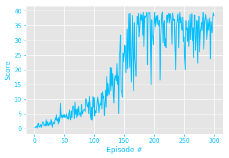

[//]: # "Image References"

[image1]: https://user-images.githubusercontent.com/10624937/43851024-320ba930-9aff-11e8-8493-ee547c6af349.gif "Trained Agent"

# ML Reacher Continuous Control DDPG

### Introduction

In this project we train an RL Unity agent in the  [Reacher](https://github.com/Unity-Technologies/ml-agents/blob/master/docs/Learning-Environment-Examples.md#reacher) environment using [DDPG](https://arxiv.org/pdf/1509.02971.pdf) algorithm.  The goal of the agent is to maintain its position at the target location. The project is implemented using PyTorch and it's part of the Udacity [DeepRL](https://github.com/udacity/deep-reinforcement-learning) nanodegree program.


![Trained Agent][image1]


## Environment/Action Description:
- The double-jointed arm can move continuously the 3D space.
- A reward of +0.1 is given for each step that the agent's hand is in the goal location.
- Actions vector has 4 entries: torque applied to the two joints of the arm.
- The state space dimension (observation) is 33 states: position, rotation, velocity, and angular velocities of the arm.


To solve the environment, the agent must get an average score of +30 over the past 100 consecutive episodes. For more details on the environment see Udacity [DeepRL nano degree/Continuous Control](https://github.com/udacity/deep-reinforcement-learning/tree/master/p2_continuous-control).


## Requirements and Dependencies
1. The Unity Reacher environment for Windows (64-bit) is included in this repo. For other OS please see the following link: [Unity Reacher Environment Download](https://github.com/udacity/deep-reinforcement-learning/tree/master/p2_continuous-control#getting-started). **Note:** make sure `AHF_DDPG_Control.py` has access to `Reacher.exe` (they are in the same folder- or the Reacher file for your OS).

2. It is highly recommended to create a conda virtual environment and install the dependencies and requirements there:

   ```
   conda create --name DRL python=3.6 
   activate DRL
   ```

3. Clone the repository, and navigate to the `python/` folder. Then, install several dependencies.

   ```
   git clone https://github.com/udacity/deep-reinforcement-learning.git
   cd deep-reinforcement-learning/python
   pip install .
   ```

   **Note:** if you face issues installing PyTorch using the above method, you can remove `torch==0.4.0` from the `python/requirements.txt` file and install PyTorch using conda using `conda install pytorch=0.4.0 -c pytorch` ([more details](https://github.com/udacity/deep-reinforcement-learning/issues/13#issuecomment-475455429)).


## Instructions

The main file is `AHF_DDPG_Control.py` that initializes the Unity Reacher environment, calls DDPG agent (`AHF_DDPG_Agent.py`), and starts training using given hyperparameters. To train the agents activate the conda environment and run `AHF_DDPG_Control.py`. The DDPG agent is defined in `AHF_DDPG_Agent.py` where you can modify batch-size, learning rate, etc. The Actor/Critic NN is defined in `AHF_model.py` where you can modify the number of hidden layers, units, activation functions, ... for actor and critic.


### Summary of the Actor/Critic NN model

Both Actor and Critic NN has the following layers and activations. You can modify the number of layers, hidden units, activation functions, dropout layers, ... to see the change in the performance.

```
  (fc1): Linear(in_features=33, out_features=400, bias=True)
  (fc2): Linear(in_features=400, out_features=300, bias=True)
  (fc3): Linear(in_features=300, out_features=4, bias=True)
```

Note that the number of `in-features` of the 1st layer should be equal to the state-space dimension of the environment which is 33. Moreover, the `out_features` of the last layer should be equal to the action-space dimension which is 4.


## Results

It is best to use GPU for running this code. It can take a very long time on CPU.

The following results are achieved using the above mentioned parameters:

``` 
Episode 100	Average Score: 4.10	Score: 10.56
Episode 200	Average Score: 22.39	Score: 35.56
Environment solved in 300 episodes with an Average Score of 34.09

Total Training time on Nvidia 1080 GPU = 141 min
```

As mentioned above the environment is considered solved when the agent achieves Average Score >= 30 in 100 consecutive Episodes.

Here is a plot of the Score vs Episodes of training:




